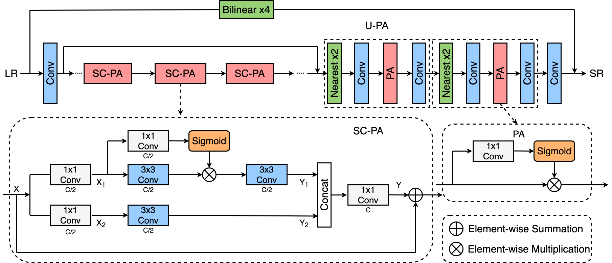

# PAN
Pixel Attention Network (PAN) is for AIM2020 Efficient Super Resolution challenge.
Only 272K than 1518K (SRResNet)




## Test Dataset
You should edit the address of test dataset in `./test_demo.py`

## Pretrained Model
The path of pretrained model is `./pretrained_model/PANetx4_DF2K.pth`

## Model File
The model file is `./PANet_arch.py`

## Test
```
python test_demo.py
```

## Results

The results are in `./test_results`

## More

Training code and more models will be released soon.
